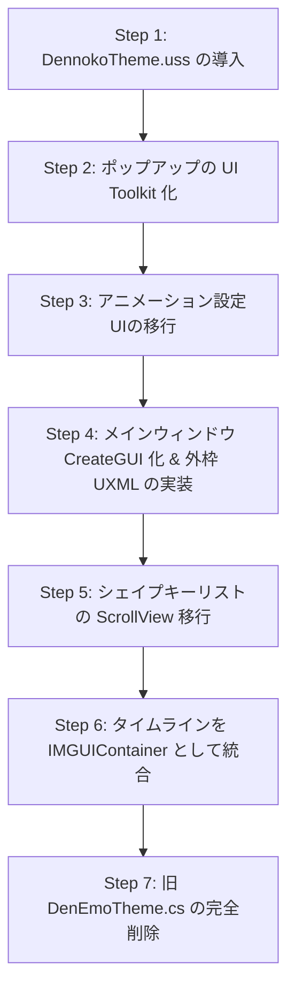

# UI Toolkit (USS) への移行計画

## 進捗状況

- [x] Step 1: `DennokoTheme.uss` の導入（`UI/DennokoTheme.uss`、GUID は `UI/DenEmoUiAssets.cs` に定数化）
- [x] Step 2: `VertexPreviewOptionsPopup` の UI Toolkit 化（`UI/VertexPreviewOptionsPopup.uxml` + `OnOpen()` 構築）— 確認済み
- [x] Step 4: メインウィンドウ `CreateGUI()` 化 & 外枠 UXML（`UI/DenEmoWindow.uxml` + `UI/DenEmoStyles.uss`。ヘッダー/タブバー/ステータスバーを UI Toolkit 化し、コンテンツ部は `IMGUIContainer` で既存描画をホスト）— 確認済み
- [x] Step 3: アニメーション設定UI（`AnimationClipCorrectionUI` / `AnimationModeUI`）の移行 — 確認済み
  - ※ これらはメインウィンドウの IMGUI 描画フロー内に埋め込まれているため、Step 4 の骨格移行を先に実施する順序に変更した
  - Animation モードは UI Toolkit の `ScrollView`（`anim-scroll`）で構成: 対象メッシュ（IMGUI）→ クリップ設定カード（UXML）→ 値補正カード（UXML + 動的行）→ タイムライン以下（IMGUI）。Pose / FX は従来どおり `content-imgui`
  - クリップ差し替え・Animation ウィンドウ競合・対象メッシュの有無は `schedule.Execute().Every(250)` のポーリングで UI に反映
  - 確認時のフィードバック: ScrollView がコンテンツ実寸を希望サイズとして報告し、兄弟要素（ヘッダー等）が flex-shrink で潰れる問題を修正（クローム要素の `flex-shrink: 0` + `flex-basis: 0`）
- [x] Step 5: シェイプキーリストの ScrollView 移行 — **Unity 上での動作確認待ち**
  - `ShapeKeyListUI` を全面 UI Toolkit 化。外枠は `ShapeKeyList.uxml`、行は `ShapeKeyRow.uxml` を CloneTree して動的生成
  - 行の集合（行プラン）を 150ms ポーリングで構築しシグネチャ比較、差分時のみ再構築。値・アイコン・グループカウント等は行バインディング経由で同期
  - Pose モードも `pose-scroll`（UITK ScrollView）に移行: 対象メッシュ〜検索フィルター（IMGUI）→ リスト（UITK）→ 保存設定（IMGUI）。`content-imgui` は FX モード専用に
  - Animation モードの `anim-bottom-imgui` を `anim-mid-imgui`（タイムライン〜検索）+ リスト（UITK）+ `anim-save-imgui`（保存）に分割。リスト要素はモード切替時にホスト間を移動
  - スライダードラッグは PointerDown/Up/CaptureOut で検出し、Undo 1 回/ジェスチャ + SMR 反映スロットル（50ms）を維持。UITK スライダーは hotControl を使わないため、`AnimationDrawContext.OnSliderDragStateChanged` でキー記録フラッシュのジェスチャ検知を補完
- [ ] Step 6: タイムラインの IMGUIContainer 統合
- [ ] Step 7: 旧 `DenEmoTheme.cs` の完全削除（`DenEmoCommonUI.DrawHeader` / `DrawStatusBar` は未使用化済み。ここで削除する）

本ドキュメントは、DenEmo の既存 IMGUI ベースの UI レイアウトから、**UI Toolkit (UXML/USS)** への移行計画をまとめたものである。移行にあたっては、`.claude/skills/dennokoworks_color_schema` スキルの USS 対応アップデートに準拠し、既存の UI レイアウトとフローティングデザイン（ダークテーマ）の維持を最優先する。

---

## 1. 参照する Skill ファイル

移行実装を行う際は、以下のスキルファイルを必ず参照すること。詳細な実装ルールや具体的なコードテンプレートはこれらのファイルに定義されているため、本ドキュメントでは参照先のみを示す。

| 参照ファイル（Skill内） | 主な用途・参照すべき内容 |
|---|---|
| [`SKILL.md`](file:///c:/Users/dennn/Programming/UnityExtension/dennokoworks/DenEmo/.claude/skills/dennokoworks_color_schema/SKILL.md) | **全体ルールと基本フロー**。`dennoko-root` の付与規則、ハードコード禁止ルール、アセットの GUID ロード手順、基本チェックリスト。 |
| [`forUnity/uss_theme_template.md`](file:///c:/Users/dennn/Programming/UnityExtension/dennokoworks/DenEmo/.claude/skills/dennokoworks_color_schema/forUnity/uss_theme_template.md) | **テーマ USS (`DennokoTheme.uss`) のソースコード**。プロジェクトへ追加し、全ての UI スタイルの起点とする。 |
| [`forUnity/techniques.md`](file:///c:/Users/dennn/Programming/UnityExtension/dennokoworks/DenEmo/.claude/skills/dennokoworks_color_schema/forUnity/techniques.md) | **UI Toolkit 固有の実装テクニックとバグ回避策**。 ・§1: テーマ非依存の仕組み（詳細度の確保） ・§3: Foldout の矢印が白い箱になる罠の回避 ・§4: アイコン（矢印等）のテーマ依存（tint-color）対策 ・§6: USS と通常の CSS の文法差異 ・§8: 旧 IMGUI 概念からの移行マッピング表 ・§10: **ライトテーマ対応とバグ回避テクニック**（入力文字が黒くなる問題への対策、ボタン型トグルの推奨、IMGUI 併用時の対策）。 |
| [`forUnity/window_structure_template.md`](file:///c:/Users/dennn/Programming/UnityExtension/dennokoworks/DenEmo/.claude/skills/dennokoworks_color_schema/forUnity/window_structure_template.md) | **EditorWindow 用テンプレート**。`DenEmoWindow`, `DenEmoTimelineWindow` の骨格としてコピーして使用する。 |
| [`forUnity/inspector_structure_template.md`](file:///c:/Users/dennn/Programming/UnityExtension/dennokoworks/DenEmo/.claude/skills/dennokoworks_color_schema/forUnity/inspector_structure_template.md) | **CustomEditor (Inspector) 用テンプレート**。将来的に Inspector 拡張を追加・修正する場合の骨格。 |

---

## 2. 既存 UI コンポーネントの移行マッピングとアプローチ

既存の各 UI ファイルについて、移行先での位置づけと具体的な移行方針を定義する。

### 2.1. エディタウィンドウの移行
- **対象ファイル**:
  - [`DenEmoWindow.cs`](file:///c:/Users/dennn/Programming/UnityExtension/dennokoworks/DenEmo/DenEmoWindow.cs)
  - [`DenEmoWindow.Sections.cs`](file:///c:/Users/dennn/Programming/UnityExtension/dennokoworks/DenEmo/DenEmoWindow.Sections.cs)
  - [`DenEmoWindow.Preferences.cs`](file:///c:/Users/dennn/Programming/UnityExtension/dennokoworks/DenEmo/DenEmoWindow.Preferences.cs)
  - [`DenEmoWindow.VertexFilter.cs`](file:///c:/Users/dennn/Programming/UnityExtension/dennokoworks/DenEmo/DenEmoWindow.VertexFilter.cs)
  - [`UI/DenEmoTimelineWindow.cs`](file:///c:/Users/dennn/Programming/UnityExtension/dennokoworks/DenEmo/UI/DenEmoTimelineWindow.cs)
- **移行アプローチ**:
  - `OnGUI()` での描画ロジックを廃止し、`CreateGUI()` メソッドによる初期化へ完全移行する。
  - レイアウトは UXML ファイル（例: `DenEmoWindow.uxml`）として外出しし、USS スタイルシートと組み合わせてロードする。
  - ウィンドウ全体の背景色は、エディタテーマに関わらずダークテーマ（`--dennoko-surface-0`）を維持するため、ルート要素に必ず `.dennoko-root` を付与し、C# 側でも保険の背景色を設定する（詳細は [`SKILL.md`](file:///c:/Users/dennn/Programming/UnityExtension/dennokoworks/DenEmo/.claude/skills/dennokoworks_color_schema/SKILL.md) §1 を参照）。
  - モード切り替え（Pose/Animation）は、UXML で定義した `TabBar` または `Toolbar` のタブ切り替えイベントによって、表示アセット領域（`VisualElement`）を切り替える方式に移行する。

### 2.2. シェイプキーリスト UI の移行
- **対象ファイル**:
  - [`UI/ShapeKeyListUI.cs`](file:///c:/Users/dennn/Programming/UnityExtension/dennokoworks/DenEmo/UI/ShapeKeyListUI.cs)
  - [`UI/ShapeKeyListUI.Rows.cs`](file:///c:/Users/dennn/Programming/UnityExtension/dennokoworks/DenEmo/UI/ShapeKeyListUI.Rows.cs)
  - [`UI/ShapeKeyListUI.Segments.cs`](file:///c:/Users/dennn/Programming/UnityExtension/dennokoworks/DenEmo/UI/ShapeKeyListUI.Segments.cs)
- **移行アプローチ**:
  - スクリプト内での動的なループによるレイアウト描画を、UI Toolkit の `ListView` または `ScrollView` を使用した構造へ移行する。
  - 各行（セグメントやシェイプキー名、お気に入りボタン、スライダー、トグル等）は、個別の UXML アセット（例: `ShapeKeyRow.uxml`）をテンプレートとして定義し、C# 側で `CloneTree()` して動的にリストに追加する。
  - 値の変更（スライダーのドラッグ、トグルの切り替え）は、各コントロールの `RegisterValueChangedCallback` にイベントを登録して `ShapeKeyModel` へ同期する。
  - レイアウトは既存の横並び配置を忠実に再現するため、Flexbox (`flex-direction: row`) を使用する。

### 2.3. アニメーション設定・補正 UI の移行
- **対象ファイル**:
  - [`UI/AnimationModeUI.cs`](file:///c:/Users/dennn/Programming/UnityExtension/dennokoworks/DenEmo/UI/AnimationModeUI.cs)
  - [`UI/AnimationClipCorrectionUI.cs`](file:///c:/Users/dennn/Programming/UnityExtension/dennokoworks/DenEmo/UI/AnimationClipCorrectionUI.cs)
- **移行アプローチ**:
  - 入力フォーム、ボタン、トグルボタンを UI Toolkit 標準の `TextField`, `ObjectField`, `Button`, `Toggle` に移行する。
  - 各アクションボタンには `.dennoko-button-primary`（アクセントカラー背景）、補助ボタンには `.dennoko-button-secondary` の USS クラスを割り当てる。
  - トグルは、ライトテーマ下での視認性とデザイン性を維持するため、チェックボックス型ではなく「トグルボタン」形式（C# でクラスの付与・削除を切り替える）に移行することを推奨する（詳細は [`techniques.md`](file:///c:/Users/dennn/Programming/UnityExtension/dennokoworks/DenEmo/.claude/skills/dennokoworks_color_schema/forUnity/techniques.md) §10.2 を参照）。

### 2.4. タイムライン UI の移行（移行方針の選択）
- **対象ファイル**:
  - [`UI/AnimationTimelineUI.cs`](file:///c:/Users/dennn/Programming/UnityExtension/dennokoworks/DenEmo/UI/AnimationTimelineUI.cs)
  - [`UI/AnimationTimelineUI.Tracks.cs`](file:///c:/Users/dennn/Programming/UnityExtension/dennokoworks/DenEmo/UI/AnimationTimelineUI.Tracks.cs)
  - [`UI/AnimationTimelineUI.Scrubber.cs`](file:///c:/Users/dennn/Programming/UnityExtension/dennokoworks/DenEmo/UI/AnimationTimelineUI.Scrubber.cs)
  - [`UI/AnimationTimelineUI.Controls.cs`](file:///c:/Users/dennn/Programming/UnityExtension/dennokoworks/DenEmo/UI/AnimationTimelineUI.Controls.cs)
- **移行アプローチ**: **IMGUIContainer によるカプセル化（推奨）**
  - **背景と判断理由**:
    タイムラインUIは、フレーム目盛りの細かいカスタム描画、キーフレームダイヤマーク（◆）の精密な絶対座標配置、ドラッグ操作による時間スクラブやキー移動など、IMGUI に強く依存した動的描画を行っている。
    これを全て純粋な `VisualElement` や Vector API (`generateVisualContent`) で再実装すると、既存のピクセルパーフェクトなレイアウト調整やイベントハンドリング（`Event.current`）の挙動を保証することが極めて困難になり、バグを誘発するリスクが高い。
  - **具体的な実装方法**:
    1. タイムラインの外枠コンテナや設定用ヘッダーは UXML/USS を用いて UI Toolkit 化する。
    2. タイムラインの描画領域（目盛りとトラック）は、UI Toolkit の **`IMGUIContainer`** を配置する。
    3. `IMGUIContainer.onGUIHandler` に、既存の `AnimationTimelineUI` の `DrawTimeline()` などの OnGUI 描画メソッドを登録する。
    4. 描画に使用するカラー（Surface0, Outline等）は、既存の `DenEmoTheme` の代わりに `DennokoTheme.uss` の変数から C# 側で動的に読み込むか、一時的に定義を維持して使用する。
  - **効果**: 「既存のUIレイアウトと挙動を基本維持する」という方針に最も合致し、安全かつ低コストで UI Toolkit 移行を完了できる。

### 2.5. 共通 UI とポップアップ
- **対象ファイル**:
  - [`UI/DenEmoCommonUI.cs`](file:///c:/Users/dennn/Programming/UnityExtension/dennokoworks/DenEmo/UI/DenEmoCommonUI.cs)
  - [`UI/VertexPreviewOptionsPopup.cs`](file:///c:/Users/dennn/Programming/UnityExtension/dennokoworks/DenEmo/UI/VertexPreviewOptionsPopup.cs)
- **移行アプローチ**:
  - `DenEmoCommonUI` のヘッダー、ステータスバーをそれぞれ UXML テンプレート（または C# での UI Toolkit パーツ生成メソッド）に置き換える。
  - ポップアップについても `CreateGUI()` に移行し、シンプルな UXML 構造を適用する。

### 2.6. 廃止予定のファイル
- **対象ファイル**:
  - [`UI/DenEmoTheme.cs`](file:///c:/Users/dennn/Programming/UnityExtension/dennokoworks/DenEmo/UI/DenEmoTheme.cs)
- **理由**:
  - UI Toolkit (USS) 化により、スタイル適用はすべて `DennokoTheme.uss` で行う。
  - IMGUI 用のテクスチャキャッシュ生成 (`MakeTex` / `MakeBorderedTex`) や `PushEditorTheme`/`PopEditorTheme` によるスタイルプッシュは一切不要になるため、本ファイルおよびアセンブリリロード時のクリーンアップ処理（`DenEmoThemeCleanup`）は完全に削除する。

---

## 3. 段階的な移行ステップ（ロードマップ）

既存の機能を壊さずに安全に移行を進めるため、以下の順序での段階的実装を推奨する。

### Step 1: `DennokoTheme.uss` の導入
1. スキルの `forUnity/uss_theme_template.md` のコードを `Assets/DenEmo/Editor/UI/DennokoTheme.uss` として配置する。
2. アセットの GUID を取得し、定数として定義できるようにする。

### Step 2: 依存度の低いUIの移行
1. ポップアップウィンドウ (`VertexPreviewOptionsPopup.cs`) を UI Toolkit 化し、UXML/USS 連携の動作テストを行う。

### Step 3: 部分的な UI Toolkit コンポーネント化
1. `AnimationClipCorrectionUI.cs` および `AnimationModeUI.cs` を UI Toolkit 化する。トグルや入力欄に対してライトテーマ文字色対策が正しく機能しているか確認する。

### Step 4: メインウィンドウの骨格移行
1. `DenEmoWindow.cs` に `CreateGUI()` を実装し、大元のレイアウト（ヘッダー、タブバー、フッター）を UXML に移行する。
2. この時点では、コンテンツ表示部はプレースホルダーにするか、暫定的に `IMGUIContainer` で既存の `DrawWindowContents()` を丸ごと呼ぶ形にして段階的に切り分ける。

### Step 5: シェイプキーリストの移行
1. リストのスクロールコンテナを `ScrollView` に置き換える。
2. 行要素を `ShapeKeyRow.uxml` から動的生成し、お気に入りトグルやスライダーをバインドする。

### Step 6: タイムライン UI の統合
1. タイムラインエリアを `IMGUIContainer` に移行し、マウスドラッグのスクラブやキーフレーム操作が期待通りに動作することを確認する。

### Step 7: クリーンアップ
1. `DenEmoTheme.cs` をプロジェクトから削除する。
2. 各ファイル内の `DenEmoTheme.Initialize()` / `PushEditorTheme()` / `PopEditorTheme()` の呼び出しコードを完全に削除する。

---

## 4. 移行後の動作確認チェックリスト

移行後は必ず以下の項目について動作確認を行うこと。詳細は [`techniques.md`](file:///c:/Users/dennn/Programming/UnityExtension/dennokoworks/DenEmo/.claude/skills/dennokoworks_color_schema/forUnity/techniques.md) §11 に準拠する。

- [ ] **エディタテーマの切り替えテスト**:
  Preferences からテーマを Light / Dark に交互に切り替え、入力欄の文字が消えたり、ボタンの枠線が崩れたりしないか。
- [ ] **ルート要素のクラス確認**:
  全てのウィンドウおよびコンテナのルート要素に `dennoko-root` クラスが正しく付与されているか。
- [ ] **GUID の確認**:
  UXML / USS アセットのロード処理でプレースホルダーが実アセットの GUID に変更されているか。
- [ ] **タイムライン動作確認**:
  `IMGUIContainer` でラップしたタイムライン領域で、キーフレームのドラッグ移動、スクラバーの操作、右クリックコンテキストメニューが以前と全く同じ挙動をするか。
- [ ] **GC / メモリリーク対策**:
  旧 `DenEmoTheme.cs` の削除に伴い、AssemblyReload 時のテクスチャ破棄漏れなどの警告・エラーが発生していないか。
